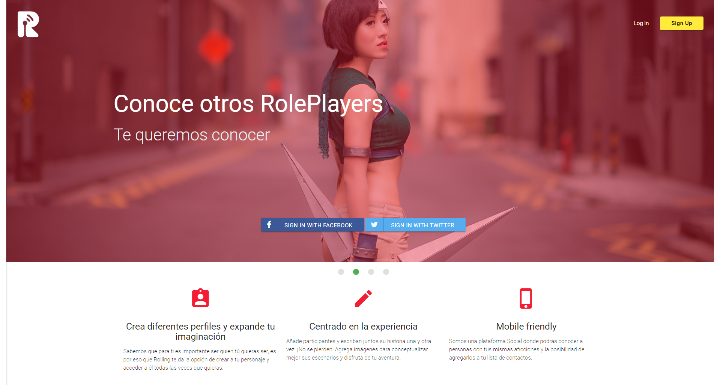
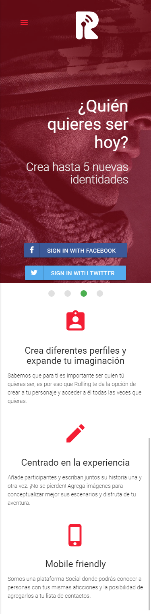

# Rolling

Es una red social para personas que gustan de "rolear" es decir, tomar la personalidad de un personaja ficticio e interactuar como tal con otros personajes. 

## Desarrollado para [laboratoria](https://laboratoria.la)

## PRODUCTO FINAL : RED SOCIAL PARA ROLPLAYERS

### Definición:

Antes de seguir con la documentación, es importante conocer la siguiente definición:

- **RolePlay** : Es un modo de juego en el que los participantes asumen la vida de un personaje para crear historias interactuando y colaborando entre ellos.

## User Research

### Planificación:

### Identificando la Problemática:

En una rápida investigación, se pudo observar que tan solo en Lima Matropolitana existe alrededor de **1536 usuarios** identificados como Rolplayers Peruanos.

La comunidad esta en crecimiento y "rolean" principalmente en Facebook y es ahí donde se encuentra la primera problemática de la comunidad.

*Para el uso de facebook, se requiere que el usuario sea **real** por lo que muchos sufrían de **cierres de cuentas** al usar nombres y fotos ficticios.*

## Benchmark : ¿Qué otros productos similares hay en el mercado?

### Análisis de la Competencia

**Roleados**

Fue lanzada al mercado, mediante una promoción en Facebook el 3 de enero del 2017.

 Una read social, que ha creado una primera página web para cubrir las necesidades de esta comunidad. Sin embargo, aún tienen varias deficiencias como por ejemplo en la creación de usuarios. Y aún no ha logrado atraer a la gran cantidad de usuarios rolplayer. Además aún no cuentan con una aplicación para mobile.

Comentarios de usuarios de la página Roleados.

**VK**

Es tildada como "Facebook rusa", debido a su estructura similar.

VK se fundó en 2006, dos años después que Facebook, y su creador fue el joven Pavel Durov, también cofundador de Telegram. Durov abandonó la compañía en 2014 tras, según se señala, ser apartado del equipo en el que era CEO por denegar una petición del gobierno ruso de compartir datos de sus usuarios.

A pesar de su gran popularidad en Rusia, tiene comentarios negativos por su funcionalidad.

## Research: Entendiendo las necesidades del usuario

Para crear nuestra red social se ha realizado entrevistas de uno a uno y encuestas (vía **Google drive**) para conocer las necesidades del usuario y así ofrecerles una mejor experiencia.

**Encuesta**
https://docs.google.com/forms/d/1pCfJyXkExKflLrU_cBmC0HnUtxJnc3Tpmwlsn1V5sFo/edit?usp=drive_web

**Resultados de la encuesta**
https://docs.google.com/spreadsheets/d/15LwXZlGyGThu5hBZqCm-4o6AzfmyfRzYdAk4eL1WDPI/edit?usp=forms_web_b#gid=516445345

**Resultados de la encuesta**

- Los usuarios están activos en su cuenta de rol, entre 4 y 7 horas al día.
- El 100% de los encuestados, al menos una vez, han perdido una cuenta por Facebook.
- Los usuarios siguen temáticas dentro y fuera de comunidades.
- Los usuarios generan lazos amicales y románticos entre sus personajes.

## Arquetipo del usuario:

### Frase de vida:
"En el rol puedes crear mundos y ser cualquier persona, sin límites"

### Perfil:

Sofía es una adolescente de 18 años, vive en San Juan de Lurigancho y estudia Pedagogía en un Instituto en el centro de la ciudad.
Vive con sus padres y su hermano menor.
Le gusta pasar tiempo en las redes sociales, y desde hace más de un año, es rolplayer. Maneja cinco cuentas en Facebook con diferentes personajes, entre varones y mujeres.
A pesar de que tiene estudios que atender, pasa en promedio unas 8 horas al día en el rol. Principalmente ingresa a sus cuentas en su celular; así pueden atender sus mensajes aunque esté en clases.
Sofía no es muy extrovertida, tiene un círculo pequeño de amigos cercanos, con los que sale los fines de semana.
Se desenvuelve mejor en los juegos de rol en Facebook, donde siente que puede crear historias sin límites.
Aún no tiene planes de dejar el rol, pues lo viene posponiendo año tras año. Mientras pueda tener tiempo para rolear, no piensa dejarlo.

### Motivaciones:

- Experimentar nuevas actividades.
- Escribir profesionalmente.
- Conocer personas de diferentes lugares.

### Metas:
- Culminar sus estudios.
- En unos años, mudarse y vivir sola.

### Frustraciones:
- En ocasiones el rol afecta su vida personal.
- Sus padres sospechan, poruque pasa mucho tiempo en redes sociales.
- Tener que crear cuentas de respaldo por los cierres de sus cuentas.

### Objetivos de Sofía en nuestra plataforma

- Desea dejar de preocuparse por el cierre de sus cuentas.
- Desea poder manejar diferentes perfiles desde una misma cuenta.
- Desea una comunidad explusiva para rolplayers
- Desea ingresar tanto en desktop como en mobile sin perder relación

## Propuesta de producto:
Nuestra propuesta es una red social llamada "Rolling", que significa movimiento. Con ello queremos captar la fluidez con que los usuarios crean historias y forman lazos entre ellos.
Brindamos una plataforma responsive que les permite crear perfiles rolplayers. La verificación que ofrecemos al acepter los términos y condiciones, permite a nuestra plataforma brindar un espacio seguro para evitar el cierre de cuentas. A la vez, evitamos que personas externas confundan los perfiles de nuestros usuarios como reales.

## Prototipado:

##### 1. Vista Splash

##### 2. Vista Home:

##### 3. Vista sign-up:

##### 4. Vista formulario pg:

##### 5. Vista perfil:

##### 7. Vista starter:

##### 8. Vista inicio:

### Flujo de aplicación:

##### 1. Vista Splash: Primera vista donde el usuario es saludado con el logo de nuestra red social.

##### 2. Home: Segunda vista donde se ofrece información sobre nuestro servicio.

##### 3. Home:: Al hacer click al botón de "Sign up", genera un formulario para generar una cuenta. Se pide el registro a través del correp electrónico.

##### 4. Log in: Al hacer click al botón "Log in" podrá acceder a su cuenta.

##### 5. Create profile: Vista donde se llenan los datos del personaje.

##### 6. Profile: Perfil del personaja creado. 
#####Se muestra una imagen de portada y su imagen de perfil. Presenta espacios para generar estados, galerías y starter. Además de una ficha sobre la historia del personaje.

##### 7. Starter: Al dar click al botón "Crear starter", se muestra la creación de historias con otros personajes. El botón flotante permite al personaje con el que se está jugando, seguir desarrollando la historia.

##### 8. Inicio: A través del botón del inicio situado en el navbar del perfil, se direcciona una vista con las actualizaciones de sus amigos y también puede acceder a sus otras vidas.

### Herramientas utilizadas:

1. HTML5
2. CSS3
3. Javascript
4. jQuery
5. Materialize
6. firebase
7. Illustrator

### **Integrantes**

>##### Yelitza Deyanira Cisneros Torre
>##### Stephanie Carolina Wong Vega

"La última y mejor experiencia que alguien tiene en cualquier lugar se convierte en la expectativa mínima de las experiencias que desean en todas partes."
